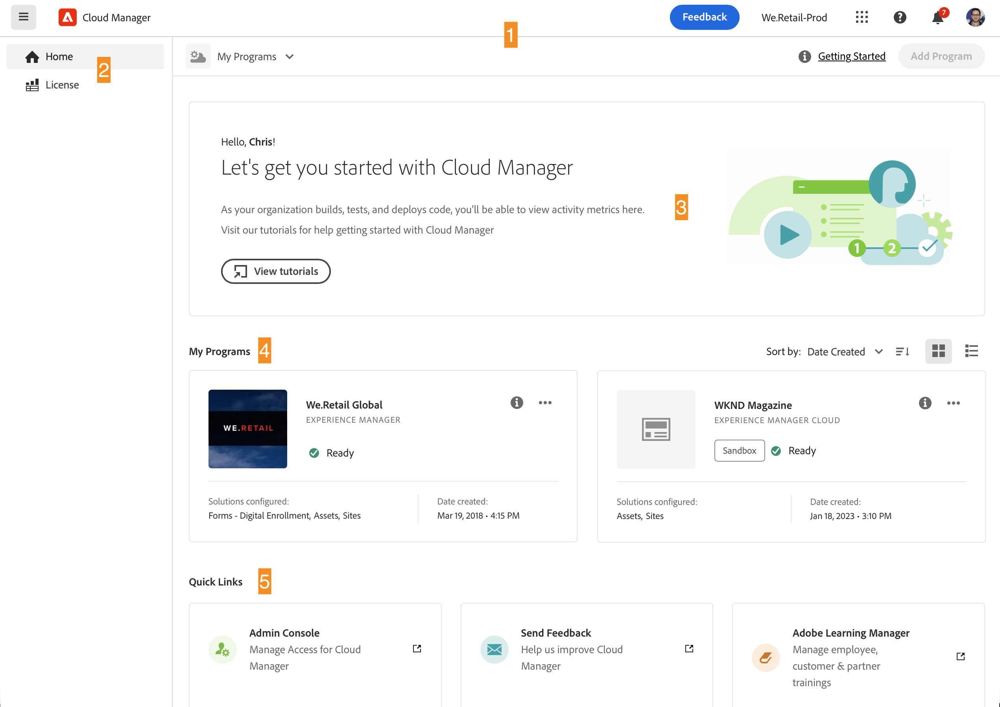
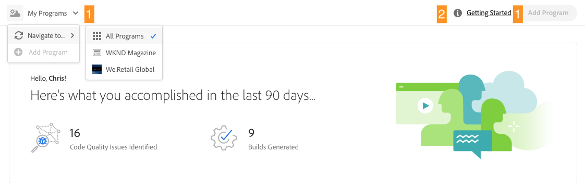

# Navigeren door de gebruikersinterface van Cloudbeheer {#navigation}

Leer hoe de interface van Cloud Manager is georganiseerd en hoe u kunt navigeren om uw programma&#39;s en omgevingen te beheren.

De interface voor cloud-beheer bestaat voornamelijk uit twee grafische interfaces:

* [De console Mijn Programma&#39;s](#my-programs) waar u al uw programma&#39;s kunt weergeven en beheren.
* [Het venster Programmaoverzicht](#program-overview) waar u de details van een afzonderlijk programma kunt zien en beheren.

## Mijn programmaconsole {#my-programs}

Wanneer u zich aanmeldt bij Cloud Manager op [my.cloudmanager.adobe.com](https://my.cloudmanager.adobe.com/) en selecteer de gewenste organisatie, komt u aan bij **Mijn programma&#39;s** console.

De console Mijn Programma&#39;s biedt een overzicht van alle programma&#39;s waartoe u toegang hebt in de geselecteerde organisatie. Het bestaat uit verschillende delen.

1. [Werkbalken](#toolbars-my-programs-toolbars) voor organisatie selectie, alarm en rekeningsmontages
1. [Statistieken en oproep tot actie](#statistics) voor een overzicht van je recente activiteiten
1. [Programma&#39;s en vergunningen](#programs-license) om uw huidige licentiestatus te begrijpen en uw programma&#39;s te beheren
1. [Snelle koppelingen](#quick-links) om gemakkelijk toegang te hebben tot verwante middelen

>[!TIP]
>
>Zie het document [Programma&#39;s en programmatypen](/help/getting-started/program-setup.md) voor meer informatie over programma&#39;s.

### Werkbalken {#my-programs-toolbars}

Er staan twee werkbalken boven op elkaar.

#### Koptekst van Wolkenbeheer {#cloud-manager-header}

De eerste is de header van Cloud Manager, die blijvend is terwijl u door Cloud Manager navigeert. Het is een anker dat u toegang geeft tot instellingen en informatie die van toepassing zijn op alle programma&#39;s van Cloud Manager.

1. Met de knop Cloud Manager gaat u terug naar de console Mijn programma&#39;s van Cloud Manager, waar u zich ook bevindt in Cloud Manager.
1. Tik of klik op Feedback om feedback te geven aan de Adobe over Cloud Manager.
1. De organisatieselecteur toont de organisatie u momenteel wordt ondertekend in (in dit voorbeeld, Interne Stichting). Tik of klik om over te schakelen naar een andere organisatie als uw Adobe ID is gekoppeld aan meerdere.
1. Als u op de schakeloptie voor oplossingen tikt of erop klikt, kunt u snel naar andere oplossingen voor Experiencen Cloud gaan.
1. Met het Help-pictogram hebt u snel toegang tot leermiddelen en ondersteuningsbronnen.
1. Het waarschuwingspictogram is gemarkeerd met het aantal momenteel toegewezen onvolledige [meldingen.](/help/using/notifications.md)
1. Selecteer het pictogram dat uw gebruiker vertegenwoordigt om tot uw gebruikersmontages toegang te hebben. Als u geen gebruikersbeeld hebt gevormd, wordt een pictogram willekeurig toegewezen.

#### Programmawerkbalk {#program-toolbar}

De werkbalk van het programma bevat koppelingen naar programma&#39;s en acties in Cloud Manager die geschikt zijn voor de context.

1. De programmakiezer wordt geopend in een vervolgkeuzelijst waar u snel andere programma&#39;s kunt selecteren of contextgerichte acties kunt uitvoeren, zoals het maken van een nieuw programma
1. Via de koppeling Aan de slag hebt u toegang tot de [Documentatietraject aan boord](https://experienceleague.adobe.com/en/docs/experience-manager-cloud-service/content/onboarding/journey/overview) om weer aan de slag te gaan met Cloud Manager.
   * Merk op dat de instapreis is ontworpen voor AEM as a Cloud Service en niet voor Cloud Service voor AMS, maar veel concepten zijn hetzelfde.
1. Met de knop Handeling kunt u contextgerichte acties uitvoeren, zoals het maken van een nieuw programma.

### Statistieken {#statistics}

Het gedeelte Statistieken bevat geaggregeerde gegevens voor uw organisatie. Als u uw programma&#39;s met succes hebt ingesteld, kunnen statistieken van uw activiteiten in de afgelopen 90 dagen worden weergegeven, zoals:

* Aantal [implementaties](/help/using/code-deployment.md)
* Aantal [problemen met de codekwaliteit](/help/using/code-quality-testing.md) geïdentificeerd
* Aantal builds

Of als u net de opstelling van uw org begint, zou er uiteinden op volgende stappen of documentatiemiddelen kunnen zijn.

### Programma&#39;s en licentie {#programs-license}

De belangrijkste inhoud van de Mijn console van Programma&#39;s is de lijst van programma&#39;s en status van uw vergunning.

#### Tabblad Programma&#39;s {#programs}

De **Programma&#39;s** worden kaarten weergegeven die elk programma vertegenwoordigen waartoe u toegang hebt. Tik of klik op een kaart om de **Programmaoverzicht** pagina van het programma voor meer informatie over het programma.

Gebruik de sorteeropties om het gewenste programma te vinden.

* Sorteren op
   * Gemaakt op (standaard)
   * Programmanaam
   * Status
* Oplopend (standaard) / Aflopend
* Rasterweergave (standaard)
* Lijstweergave

Elk programma wordt vertegenwoordigd door een kaart (of rij in een lijst), die een overzicht van het programma en snelle verbindingen verstrekt om actie te ondernemen.

* Programmaafbeelding (indien geconfigureerd)
* Programmanaam
* Servicetype: **Experience Manager Cloud** for [as a Cloud Service programma&#39;s AEM](https://experienceleague.adobe.com/en/docs/experience-manager-cloud-service/content/implementing/home) of **Experience Manager** voor AMS-programma&#39;s
* [Programmatype](/help/getting-started/program-setup.md): zandbak of productie
* Status
* Gevormde oplossingen
* Aanmaakdatum

Met het informatiepictogram hebt u ook snel toegang tot aanvullende informatie over het programma (nuttig in de lijstweergave).

Het ellipsiepictogram geeft u toegang tot extra acties u het programma kunt nemen.

* Naar een bepaalde locatie navigeren [milieu](/help/using/managing-environments.md) van het programma
* Open de [programmaoverzicht](#program-overview)
* [Het programma bewerken](/help/getting-started/program-setup.md)
* Controle tonen

#### Tabblad Licentie {#license-tab}

De **Licentie** biedt u snel toegang tot het licentiedashboard.

### Snelle koppelingen {#quick-links}

De snelle sectie van verbindingen geeft u toegang tot algemeen gebruikte, verwante middelen.

## Venster Overzicht van programma {#program-overview}

Zodra u een programma in de Mijn console van Programma&#39;s selecteert, wordt u genomen aan het Overzicht van het Programma.

In het programmaoverzicht hebt u toegang tot alle details van een programma van Cloud Manager. Zoals de Mijn console van Programma&#39;s, wordt het gemaakt van verscheidene delen.

1. [Werkbalken](#program-overview-toolbar) om snel terug naar de Mijn console van Programma&#39;s te springen evenals het programma te navigeren
1. [Tabs](#program-tabs) schakelen tussen verschillende aspecten van het programma
1. A [oproep tot actie](#cta) op basis van de laatste acties van het programma
1. An [overzicht van de omgevingen](#environments) van het programma
1. An [overzicht van de pijpleidingen](#pipelines) van het programma
1. Koppelingen naar [nuttige bronnen](#useful-resources)

### Werkbalken {#program-overview-toolbar}

De werkbalken voor het programmaoverzicht lijken sterk op die van het dialoogvenster [Mijn Programs-console.](#my-programs-toolbars) Alleen de verschillen worden hier geïllustreerd.

#### Koptekst van Wolkenbeheer {#cloud-manager-header-2}

De koptekst van Cloud Manager bevat een hamburgermenu dat automatisch wordt geopend om de tabbladen weer te geven waarop u kunt navigeren in het programmaoverzicht.

Tik of klik op het hamburger-menupictogram om de tabbladen te verbergen.

#### Programmawerkbalk {#program-toolbar-2}

Op de werkbalk van het programma hebt u nog steeds toegang om snel over te schakelen naar andere programma&#39;s, maar hebt u ook toegang tot contextgerichte acties, zoals het toevoegen en bewerken van het programma.

Bovendien geeft de werkbalk altijd aan op welk tabblad u de tabbladen wilt verbergen via het hamburgermenu.

### Programmatabs {#program-tabs}

Elk programma heeft een heleboel opties en gegevens verbonden aan het. Deze gegevens worden verzameld in lusjes om het navigeren van het programma eenvoudiger te maken. Met de tabbladen hebt u toegang tot:

* Overzicht - Het programma-overzicht zoals beschreven in het huidige document
* [Activiteit](/help/using/managing-pipelines.md#activity) - De geschiedenis van de pijpleiding van het programma
* [Pijpleidingen](/help/using/managing-pipelines.md#pipelines) - Alle voor het programma geconfigureerde pijpleidingen
* [Opslagplaatsen](/help/managing-code/repositories.md) - Alle voor het programma geconfigureerde opslagruimten
* [Rapporten](/help/using/monitoring-environments.md#system-monitoring-overview) - Metriek zoals SLA-gegevens
* [Omgevingen](/help/using/managing-environments.md) - Alle omgevingen die voor het programma zijn geconfigureerd
* [Inhoudssets](/help/using/content-copy.md) - Sets inhoud die voor kopieerdoeleinden is gemaakt
* [Inhoudsactiviteit kopiëren](/help/using/content-copy.md) - Kopieeractiviteiten voor inhoud
* Leerpaden - Aanvullende leerbronnen over Cloud Manager

Wanneer u een programma opent, komt u standaard aan op het tabblad **Overzicht** tab. Het huidige tabblad wordt gemarkeerd. Selecteer een ander tabblad om de details ervan weer te geven.

Het menu van de hamburger gebruiken in het dialoogvenster [Koptekst van Cloud Manager](#cloud-manager-header-2) om de tabbladen te verbergen.

### Oproep tot actie {#cta}

De vraag-aan-actie sectie zal u nuttige informatie afhankelijk van de status van uw programma geven. Voor een nieuw programma ziet u mogelijk de volgende stappen worden aangeboden en een herinnering aan een datum waarop u live gaat, [ingesteld tijdens het maken van programma&#39;s.](/help/getting-started/program-setup.md)

Voor een levend programma, de status van uw laatste plaatsing met verbindingen voor details en het beginnen van een nieuwe plaatsing.

### Milieukaart {#environments}

De **Omgevingen** -kaart geeft u een overzicht van uw omgevingen en koppelingen voor snelle acties.

De **Omgevingen** kaart bevat slechts drie omgevingen. Klikken **Alles tonen** om alle omgevingen van het programma te zien.

Zie het document [Omgevingen beheren](/help/using/managing-environments.md) voor meer informatie over hoe u uw omgevingen kunt beheren.

### Pijppijplijnkaart {#pipelines}

De **Pijpleidingen** Deze kaart geeft u een overzicht van uw pijpleidingen en koppelingen voor snelle acties.

De **Pijpleidingen** kaart bevat slechts drie pijpleidingen. Klikken **Alles tonen** alle pijpleidingen van het programma te zien.

Zie het document [Pijpleidingen beheren](/help/using/managing-pipelines.md) voor meer informatie over het beheer van uw pijpleidingen.

### Nuttige bronnen {#useful-resources}

De **Nuttige bronnen** bevat koppelingen naar aanvullende leerbronnen voor Cloud Manager.