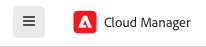

# Navigeren door de gebruikersinterface van Cloudbeheer {#navigation}

Leer hoe de gebruikersinterface van Cloud Manager is georganiseerd en hoe u kunt navigeren om uw programma&#39;s en omgevingen te beheren.

De interface voor cloud-beheer bestaat voornamelijk uit twee grafische interfaces:

* [ De Mijn console van Programma&#39;s ](#my-programs-console) waar u al uw programma&#39;s kunt bekijken en beheren.
* [ het venster van het Overzicht van het Programma ](#program-overview) waar u het detail van kunt zien en een individueel programma beheren.

## Mijn programmaconsole {#my-programs-console}

Wanneer u login in Cloud Manager bij [ my.cloudmanager.adobe.com ](https://my.cloudmanager.adobe.com/) en de aangewezen organisatie selecteert, komt u bij de **Mijn console van Programma&#39;s** aan.

De console Mijn Programma&#39;s biedt een overzicht van alle programma&#39;s waartoe u toegang hebt in de geselecteerde organisatie. Het bestaat uit verschillende delen.

1. [ Toolbars ](#toolbars-my-programs-toolbars) voor organisatieselectie, alarm, en rekeningsmontages
1. Tabs waarmee u de huidige weergave van uw programma&#39;s kunt schakelen.
   * **Begin** mening (gebrek) die **Mijn mening van Programma&#39;s** met een overzicht van alle programma&#39;s selecteert
   * **Vergunning** die tot het Dashboard van de Vergunning toegang heeft. Het licentiedashboard geldt alleen voor AEM as a Cloud Service-programma&#39;s, niet voor AMS-programma&#39;s.
      * Om het type van de dienst te bepalen uw programma heeft (AMS of AEMaaCS), gelieve de [ sectie van de Kaarten van het Programma ](#program-cards) van dit document te zien.
   * Merk op dat het gebrek van lusjes aan gesloten en kan worden onthuld gebruikend het hamburgermenu in de [ kopbal van Cloud Manager.](#cloud-manager-header)
1. [ Vraag-aan-Acties en Statistieken ](#cta-statistics) voor een overzicht van uw recente activiteit
1. [**Mijn Programma&#39;s** sectie ](#my-programs-section) met een overzicht van al uw programma&#39;s
1. [ Snelle verbindingen ](#quick-links) om tot verwante middelen gemakkelijk toegang te hebben

>[!TIP]
>
>Gelieve te zien het document [ Programma&#39;s en de Types van Programma ](/help/getting-started/program-setup.md) voor details op programma&#39;s.

### Werkbalken {#my-programs-toolbars}

Er staan twee werkbalken boven op elkaar.

#### Cloud Manager-koptekst {#cloud-manager-header}

De eerste is de Cloud Manager header, die blijvend is terwijl je door Cloud Manager navigeert. Het is een anker dat u toegang geeft tot instellingen en informatie die van toepassing zijn op alle Cloud Manager-programma&#39;s.

1. Het hamburger menu dat toegang tot lusjes geeft die u aan specifieke delen van a in individueel programma kunnen nemen of tussen het Dashboard van de Vergunning en **[Mijn console van Programma&#39;s](#my-programs-console)** afhankelijk van context schakelen.
   * Het licentiedashboard geldt alleen voor AEM as a Cloud Service-programma&#39;s, niet voor AMS-programma&#39;s.
   * Om het type van de dienst te bepalen uw programma heeft (AMS of AEMaaCS), gelieve de [ sectie van de Kaarten van het Programma ](#program-cards) van dit document te zien.
1. Met de knop Cloud Manager gaat u terug naar de console Mijn programma&#39;s van Cloud Manager, waar u zich ook in Cloud Manager bevindt.
1. Tik of klik op Feedback om feedback te geven aan de Adobe over Cloud Manager.
1. De organisatieselecteur toont de organisatie u momenteel wordt ondertekend in (in dit voorbeeld, Interne Stichting). Tik of klik om over te schakelen naar een andere organisatie als uw Adobe ID is gekoppeld aan meerdere.
1. Als u op de schakeloptie voor oplossingen tikt of erop klikt, kunt u snel naar andere oplossingen voor Experiencen Cloud gaan.
1. Met het Help-pictogram hebt u snel toegang tot leermiddelen en ondersteuningsbronnen.
1. Het berichtpictogram is badged met het aantal momenteel toegewezen onvolledige [ berichten.](/help/using/notifications.md)
1. Selecteer het pictogram dat uw gebruiker vertegenwoordigt om tot uw gebruikersmontages toegang te hebben. Als u geen gebruikersbeeld hebt gevormd, wordt een pictogram willekeurig toegewezen.

#### Programmawerkbalk {#program-toolbar}

Op de werkbalk van het programma vindt u koppelingen naar de verschillende Cloud Manager-programma&#39;s en naar acties die binnen de context passen.

1. De programmakiezer wordt geopend in een vervolgkeuzelijst waar u snel andere programma&#39;s kunt selecteren of contextgerichte acties kunt uitvoeren, zoals het maken van een nieuw programma
1. De het worden begonnen verbinding geeft u toegang tot [ op het instappen documentatiereis ](https://experienceleague.adobe.com/en/docs/experience-manager-cloud-service/content/onboarding/journey/overview) om u met Cloud Manager op te halen.
   * De instapreis is ontworpen voor AEM as a Cloud Service en niet voor Cloud Service voor AMS, maar veel concepten zijn hetzelfde.
1. Met de knop Handeling kunt u contextgerichte acties uitvoeren, zoals het maken van een nieuw programma.

### Vraag-aan-Acties en Statistieken {#cta-statistics}

De vraag-aan-actie en statistieksectie verstrekt gezamenlijke gegevens voor uw organisatie, bijvoorbeeld, als u met succes uw programma&#39;s hebt opgezet, zouden de statistieken van uw activiteiten in de afgelopen 90 dagen kunnen tonen, die omvatten:

* Aantal [ plaatsingen ](/help/using/code-deployment.md)
* Aantal ](/help/using/code-quality-testing.md) geïdentificeerde kwesties van de 0} codekwaliteit[
* Aantal builds

Of als u net de opstelling van uw org begint, zou er uiteinden op volgende stappen of documentatiemiddelen kunnen zijn.

### Sectie Mijn programma&#39;s {#my-programs-section}

De belangrijkste inhoud van de Mijn console van Programma&#39;s is de **Mijn sectie van Programma&#39;s** die van uw programma&#39;s als individuele kaarten een lijst maakt. Tik of klik op een kaart om tot de **pagina van het Overzicht van het Programma** van het programma voor details over het programma toegang te hebben.

>[!NOTE]
>
>Afhankelijk van uw rechten kunt u bepaalde programma&#39;s mogelijk niet selecteren.

Gebruik de sorteeropties om het gewenste programma te vinden.

* Sorteren op
   * Gemaakt op (standaard)
   * Programmanaam
   * Status
* Oplopend (standaard) / Aflopend
* Rasterweergave (standaard)
* Lijstweergave

#### Programmakaarten {#program-cards}

Elk programma wordt vertegenwoordigd door een kaart (of rij in een lijst), die een overzicht van het programma en snelle verbindingen verstrekt om actie te ondernemen.

* Programmaafbeelding (indien geconfigureerd)
* Programmanaam
* Servicetype:
   * **Experience Manager** voor de programma&#39;s van AMS
   * **Cloud van de Experience Manager** voor [ AEM as a Cloud Service programma&#39;s ](https://experienceleague.adobe.com/en/docs/experience-manager-cloud-service/content/implementing/home)
* Status
* Gevormde oplossingen
* Aanmaakdatum

Met het informatiepictogram hebt u ook snel toegang tot aanvullende informatie over het programma (nuttig in de lijstweergave).

Het ellipsiepictogram geeft u toegang tot extra acties u het programma kunt nemen.

* Navigeer aan een bepaald [ milieu ](/help/using/managing-environments.md) van het programma
* Open het [ programmaoverzicht ](#program-overview)
* [Het programma bewerken](/help/getting-started/program-setup.md)
* Controle tonen

### Snelle koppelingen {#quick-links}

De snelle sectie van verbindingen geeft u toegang tot algemeen gebruikte, verwante middelen.

## Venster Overzicht van programma {#program-overview}

Zodra u een programma in de [**Mijn console van Programma&#39;s** selecteert, ](#my-programs-console) u aan het Overzicht van het Programma wordt genomen.

In het programmaoverzicht hebt u toegang tot alle details van een Cloud Manager-programma. Zoals de Mijn console van Programma&#39;s, wordt het gemaakt van verscheidene delen.

1. [ Toolbars ](#program-overview-toolbar) om snel terug naar de Mijn console van Programma&#39;s te springen evenals het programma te navigeren
1. [ Lusjes ](#program-tabs) om tussen verschillende aspecten van het programma te schakelen
1. A [ vraag-aan-actie ](#cta) die op de laatste acties van het programma wordt gebaseerd
1. Een [ overzicht van de milieu&#39;s ](#environments) van het programma
1. Een [ overzicht van de pijpleidingen ](#pipelines) van het programma
1. Verbindingen met [ nuttige middelen ](#useful-resources)

### Werkbalken {#program-overview-toolbar}

De toolbars voor het programmaoverzicht zijn zeer gelijkaardig aan die van de [ Mijn console van Programma&#39;s.](#my-programs-toolbars) Alleen de verschillen worden hier weergegeven.

#### Cloud Manager-koptekst {#cloud-manager-header-2}

De Cloud Manager-header heeft een hamburgermenu dat automatisch wordt geopend om de navigeerbare tabbladen van het programmaoverzicht weer te geven.

Tik of klik op het hamburger-menupictogram om de tabbladen te verbergen.

#### Programmawerkbalk {#program-toolbar-2}

Op de werkbalk van het programma hebt u nog steeds toegang om snel over te schakelen naar andere programma&#39;s, maar hebt u ook toegang tot contextgerichte acties, zoals het toevoegen en bewerken van het programma.

Bovendien geeft de werkbalk altijd aan op welk tabblad u de tabbladen wilt verbergen via het hamburgermenu.

### Programmatabs {#program-tabs}

Elk programma heeft een heleboel opties en gegevens verbonden aan het. Deze gegevens worden verzameld in lusjes om het navigeren van het programma eenvoudiger te maken. Met de tabbladen hebt u toegang tot:

* Overzicht - Het programma-overzicht zoals beschreven in het huidige document
* [ Activiteit ](/help/using/managing-pipelines.md#activity) - de geschiedenis van pijpleidingslooppas van het programma
* [ Pijpleidingen ](/help/using/managing-pipelines.md#pipelines) - Alle pijpleidingen die voor het programma worden gevormd
* [ Bewaarplaatsen ](/help/managing-code/managing-repositories.md) - Alle bewaarplaatsen die voor het programma worden gevormd
* [ Rapporten ](/help/using/monitoring-environments.md#system-monitoring-overview) - Metriek zoals de gegevens van SLA
* [ Milieu&#39;s ](/help/using/managing-environments.md) - Alle milieu&#39;s die voor het programma worden gevormd
* [ Reeksen van de Inhoud ](/help/using/content-copy.md) - Reeksen van inhoud die voor exemplaardoeleinden wordt gecreeerd
* [ Activiteit van de Inhoud van het Exemplaar ](/help/using/content-copy.md) - de activiteiten van het Inhoudsexemplaar
* Leerpaden - Aanvullende leerbronnen over Cloud Manager

Door gebrek, wanneer u een programma opent u op het **Overzicht** tabel aankomt. Het huidige tabblad wordt gemarkeerd. Selecteer een ander tabblad om de details ervan weer te geven.

Gebruik het hamburger menu in de [ kopbal van Cloud Manager ](#cloud-manager-header-2) om de lusjes te verbergen.

### Oproep tot actie {#cta}

De vraag-aan-actie sectie zal u nuttige informatie afhankelijk van de status van uw programma geven. Voor een nieuw programma kunt u volgende stappen zien die evenals een herinnering van een go-live datum worden aangeboden, [ tijdens programmaverwezenlijking wordt geplaatst.](/help/getting-started/program-setup.md)

Voor een levend programma, de status van uw laatste plaatsing met verbindingen voor details en het beginnen van een nieuwe plaatsing.

### Milieukaart {#environments}

De **kaart van Milieu** geeft u een overzicht van uw milieu&#39;s evenals verbindingen voor snelle acties.

De **kaart van Milieu** maakt een lijst van slechts drie milieu&#39;s. Klik **tonen allen** om alle milieu&#39;s van het programma te zien.

Gelieve te zien het document [ Leiden Milieu ](/help/using/managing-environments.md) voor details op hoe te om uw milieu&#39;s te beheren.

### Pijppijplijnkaart {#pipelines}

De **Pijpleidingen** kaart geeft u een overzicht van uw pijpleidingen evenals verbindingen voor snelle acties.

De **Pijpleidingen** kaart maakt slechts van drie pijpleidingen een lijst. Klik **tonen allen** om alle pijpleidingen van het programma te zien.

Gelieve te zien het document [ Leiden Pijpleidingen ](/help/using/managing-pipelines.md) voor details op hoe te om uw pijpleidingen te beheren.

### Nuttige bronnen {#useful-resources}

De **Nuttige 1} sectie van Middelen {verstrekt verbindingen aan extra het leren middelen voor Cloud Manager.**
