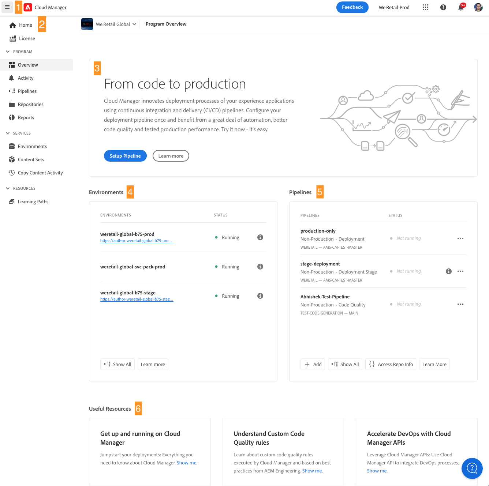
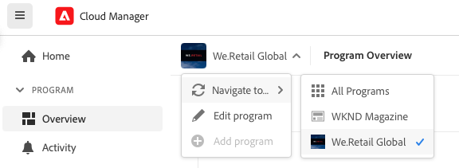

# Navigeren door de gebruikersinterface van Cloud Manager {#navigation}

Leer hoe de gebruikersinterface van Cloud Manager is georganiseerd en hoe u kunt navigeren om uw programma&#39;s en omgevingen te beheren.

De gebruikersinterface van Cloud Manager bestaat voornamelijk uit twee grafische interfaces:

* [ de Mijn console van Programma&#39;s ](#my-programs-console) is waar u al uw programma&#39;s kunt bekijken en beheren.
* [ het venster van het Overzicht van het Programma ](#program-overview) is waar u het detail van kunt zien en een individueel programma beheren.

## Mijn Programmaconsole {#my-programs-console}

Wanneer u in Cloud Manager bij [ experience.adobe.com ](https://experience.adobe.com/experiencemanager) registreert en de aangewezen organisatie selecteert, komt u bij de **Mijn console van Programma&#39;s** aan.

De **Mijn console van Programma&#39;s** verstrekt een overzicht van alle programma&#39;s waartot u toegang in de geselecteerde organisatie hebt. Het bestaat uit verschillende delen.

|   | Gebied | Beschrijving |
| --- | --- | --- |
| 1 | [ Toolbars ](#toolbars-my-programs-toolbars) | Wordt gebruikt voor het selecteren van organisaties, waarschuwingen en accountinstellingen. |
| 2 | Tabblad van deelvenster Links | Diverse lusjes die u laten de huidige mening van uw programma&#39;s, met inbegrip van het volgende van een knevel voorzien: <ul><li>**Experience Manager** opent de homepage voor uw diverse oplossingen van AEM</li><li>**Alle Programma&#39;s** die alle beschikbare programma&#39;s toont.</li><li>**Vergunning** opent het Dashboard van de Vergunning. Het dashboard van de Vergunning is slechts op *AEM as a Cloud Service programma&#39;s* (AEMaaCS), niet op de programma&#39;s van Adobe Managed Services zoals AEM 6.5 en AEM 6.5 LTS van toepassing. Om het type van de dienst te bepalen heeft uw programma (AEMaaCS of AMS), zie de [ sectie van de Kaarten van het Programma ](#program-cards) van dit artikel. Het gebrek van lusjes aan gesloten en kan worden onthuld gebruikend het  drop-down menu, dat op de linkerkant van de [ kopbal van Cloud Manager ](#cloud-manager-header) wordt gevestigd.</li></ol> |
| 3 | [ Mijn Programma&#39;s ](#my-programs-section) | Hiermee geeft u alle beschikbare programma&#39;s weer die u kunt selecteren.  zie [ Programma&#39;s en de Types van Programma ](/help/getting-started/program-setup.md) voor details op programma&#39;s. |
| 4 | [ vraag-aan-acties en statistieken ](#cta-statistics) | Geeft een overzicht van je recente activiteiten. |
| 5 | [ Snelle verbindingen ](#quick-links) | Snelle toegang tot gerelateerde bronnen. |

### Werkbalken {#my-programs-toolbars}

Er staan twee werkbalken boven op elkaar.

#### Cloud Manager header {#cloud-manager-header}

De eerste is de Cloud Manager header. De header is blijvend terwijl u door Cloud Manager navigeert. Het is een anker dat u toegang geeft tot instellingen en informatie die van toepassing zijn op alle Cloud Manager-programma&#39;s.

|   | Gebied | Beschrijving |
| --- | --- | --- |
| 1 |  | Een vervolgkeuzemenu dat toegang biedt tot tabbladen voor specifieke onderdelen van een afzonderlijk programma.  om het type van de dienst te bepalen uw programma heeft (AMS of AEMaaCS), zie de [ sectie van de Kaarten van het Programma ](#program-cards) van dit document. |
| 2 | Adobe Cloud Manager | Klik om de **Mijn console van Programma&#39;s** van Cloud Manager, geen kwestie te openen waar u in Cloud Manager bent. |
| 3 | Geselecteerde organisatie | De organisatieselecteur toont de organisatie die u momenteel wordt ondertekend (in dit voorbeeld, de Interne Stichting van de Stichting). Klik om over te schakelen naar een andere organisatie als uw Adobe ID is gekoppeld aan meerdere organisaties. |
| 4 | Feedbackpictogram | Klik hierop om Adobe feedback te geven over Cloud Manager. |
| 5 | AI Assistant-pictogram | Biedt een conversatie-interface die is ontworpen om het zoeken naar antwoorden op AEM-gerelateerde vragen te stroomlijnen. Zie [ AI Medewerker ](https://experienceleague.adobe.com/nl/docs/experience-manager-65/content/ai-assistant/ai-assistant-in-aem) |
| 6 |  | Klik om snel toegang tot het leren en de steunmiddelen te verlenen. |
| 7 |  | Klik om het aantal momenteel toegewezen onvolledige [ berichten ](/help/using/notifications.md) te bekijken |
| 8 |  | Klik om snel te schakelen tussen de AEM Home-pagina en AEM-oplossingen |
| 9 | App-pictogram | Klik om tot uw **Montages van de Rekening** en **Montages van het Programma** toegang te hebben, of uit te tekenen. |

<!--
1. The  icon on the left side of the header is  
   * The License Dashboard only applies to AEM as a Cloud Service programs, not AMS programs.
   * To determine the type of service your program has (AMS or AEMaaCS), see the [Program Cards section](#program-cards) of this document.
1. The **Adobe Cloud Manager** button takes you back to the **My Programs** console of Cloud Manager no matter where you are in Cloud Manager.
1. Click **Feedback** to provide feedback to Adobe about Cloud Manager.
1. The organization selector displays the organization that you are currently signed into (in this example, Foundation Internal). Click to switch to another organization if your Adobe ID is associated with multiple.
1. Clicking the solutions switcher lets you quickly jump to other Experience Cloud solutions.
1. The Help icon provides quick access to learning and support resources.
1. The notifications icon is badged with the number of currently assigned incomplete [notifications](/help/using/notifications.md)
1. Select the icon representing your user to access your user settings. If you do not select a user picture, an icon is randomly assigned. -->

#### Programmawerkbalk {#program-toolbar}

Op de werkbalk van het programma vindt u koppelingen naar de verschillende Cloud Manager-programma&#39;s en naar acties die binnen de context passen.

|   | Gebied | Beschrijving |
| --- | --- | --- |
| 1 | Mijn programma&#39;s | Klik hierop om een vervolgkeuzelijst te openen waarin u een programma kunt toevoegen, andere bestaande programma&#39;s kunt selecteren of kunt terugkeren naar de startpagina van Experience Manager. |
| 2 | Aan de slag | Klik om tot de [ toegang te hebben op het instappen documentatietraject ](https://experienceleague.adobe.com/nl/docs/experience-manager-cloud-service/content/onboarding/journey/overview) om u met Cloud Manager in werking te stellen.  de reis aan boord wordt ontworpen voor Cloud Manager op Adobe Experience Manager as a Cloud Service (AEMaaCS), en niet voor Cloud Manager op Adobe Managed Services (AMS). Veel concepten zijn echter hetzelfde. |
| 3 | Dynamische actieknop | Met de handelingstoets kunt u contextgevoelige handelingen uitvoeren, zoals het toevoegen van een programma, het toevoegen van een domein of het toevoegen van een SSL-certificaat. |

### Oproep tot actie en statistieken {#cta-statistics}

Het gedeelte call-to-action en statistiek bevat geaggregeerde gegevens voor uw organisatie. Als u bijvoorbeeld uw programma&#39;s hebt ingesteld, kunnen statistieken van uw activiteiten in de afgelopen 90 dagen worden weergegeven, zoals:

* Aantal [ plaatsingen ](/help/using/code-deployment.md)
* Aantal [ geïdentificeerde kwesties van de 0&rbrace; codekwaliteit](/help/using/code-quality-testing.md)
* Aantal builds

Of als u net de opstelling van uw org begint, zou er uiteinden op volgende stappen of documentatiemiddelen kunnen zijn.

### Mijn programma&#39;s {#my-programs-section}

De belangrijkste inhoud van de Mijn console van Programma&#39;s is de **Mijn sectie van Programma&#39;s** die van uw programma&#39;s als individuele kaarten een lijst maakt. Klik een kaart om tot de **pagina van het Overzicht van het Programma** van het programma voor details over het programma toegang te hebben.

Afhankelijk van uw rechten kunt u bepaalde programma&#39;s mogelijk niet selecteren.

U kunt de volgende sorteeropties gebruiken om snel het gewenste programma te zoeken:

* Sorteren op:
   * Gemaakt op
   * Programmanaam
   * Status
*  /  de programma&#39;s van de Soort neer of omhoog, respectievelijk.
*  /  de programma&#39;s van de Mening in netvorm of lijstvorm, respectievelijk.

#### Programmakaarten {#program-cards}

Een kaart of rij in een tabel vertegenwoordigt elk programma en biedt een overzicht van het programma en snelle koppelingen om actie te ondernemen.

* Programmaafbeelding (indien geconfigureerd)
* Programmanaam
* Servicetype:
   * **Experience Manager** voor de programma&#39;s van AMS
   * **de Wolk van Experience Manager** voor [ AEM as a Cloud Service programma&#39;s ](https://experienceleague.adobe.com/nl/docs/experience-manager-cloud-service/content/implementing/home)
* Status
* Gevormde oplossingen
* Aanmaakdatum

Met het informatiepictogram hebt u ook snel toegang tot aanvullende informatie over het programma (nuttig in de lijstweergave).

Het  geeft u toegang tot extra acties u het programma kunt nemen.

* Navigeer aan een bepaald [ milieu ](/help/using/managing-environments.md) van het programma
* Open het [ programmaoverzicht ](#program-overview)
* [Het programma bewerken](/help/getting-started/program-setup.md)
* Controle tonen

### Snelle koppelingen {#quick-links}

In de sectie Snelle koppelingen hebt u toegang tot nuttige, verwante bronnen.

## Het venster Overzicht van programma {#program-overview}

Het selecteren van een programma in de [**Mijn console van Programma&#39;s** ](#my-programs-console) neemt u aan de **pagina van het Overzicht van het Programma**.

Het overzicht van het Programma geeft u toegang tot alle details van een Cloud Manager-programma. Zoals de Mijn console van Programma&#39;s, wordt het gemaakt van verscheidene delen.

1. [ Toolbars ](#program-overview-toolbar) om terug naar de **Mijn console van Programma&#39;s** snel te springen en het programma te navigeren.
1. [ Lusjes ](#program-tabs) om tussen verschillende aspecten van het programma te schakelen.
1. A [ call-to-action ](#cta) die op de laatste acties van het programma wordt gebaseerd.
1. Een [ overzicht van de milieu&#39;s ](#environments) van het programma.
1. Een [ overzicht van de pijpleidingen ](#pipelines) van het programma.
1. Verbindingen met [ nuttige middelen ](#useful-resources).

### Werkbalken {#program-overview-toolbar}

De toolbars voor het Overzicht van het Programma zijn gelijkaardig aan toolbars van de [ Mijn console van Programma&#39;s ](#my-programs-toolbars). Alleen de verschillen worden hier geïllustreerd.

#### Cloud Manager header {#cloud-manager-header-2}

De kopbal van Cloud Manager heeft a  drop-down menu dat automatisch opent om de navigable lusjes van het Overzicht van het Programma te tonen.

Klik  om de lusjes te verbergen.

#### Programmawerkbalk {#program-toolbar-2}

Op de werkbalk van het programma hebt u nog steeds toegang om snel over te schakelen naar andere programma&#39;s, maar hebt u ook toegang tot contextgerichte acties, zoals het toevoegen en bewerken van het programma.

Bovendien, als u de lusjes gebruikend  verbergt, kan de toolbar nog het lusje tonen dat u momenteel bent.

### Tabbladen van programma {#program-tabs}

Elk programma heeft talrijke opties en gegevens verbonden aan het. Deze gegevens worden verzameld in lusjes om het navigeren van het programma eenvoudiger te maken. Met de tabbladen hebt u toegang tot:

* Overzicht - Het programma-overzicht zoals beschreven in het huidige document
* [ Activiteit ](/help/using/managing-pipelines.md#activity) - de geschiedenis van pijpleidingslooppas van het programma
* [ Pijpleidingen ](/help/using/managing-pipelines.md#pipelines) - Alle pijpleidingen die voor het programma worden gevormd
* [ Bewaarplaatsen ](/help/managing-code/managing-repositories.md) - Alle bewaarplaatsen die voor het programma worden gevormd
* [ Rapporten ](/help/using/monitoring-environments.md#system-monitoring-overview) - Metriek zoals de gegevens van SLA
* [ Milieu&#39;s ](/help/using/managing-environments.md) - Alle milieu&#39;s die voor het programma worden gevormd
* [ Reeksen van de Inhoud ](/help/using/content-copy.md) - Reeksen van inhoud die voor exemplaardoeleinden wordt gecreeerd
* [ Activiteit van de Inhoud van het Exemplaar ](/help/using/content-copy.md) - de activiteiten van het Inhoudsexemplaar
* Leerpaden - Aanvullende leerbronnen over Cloud Manager

Door gebrek, wanneer u een programma opent u op het **Overzicht** tabel aankomt. Het huidige tabblad wordt gemarkeerd. Selecteer een ander tabblad om de details ervan weer te geven.

Het gebruik  in de [ kopbal van Cloud Manager ](#cloud-manager-header-2) om de lusjes te verbergen.

### Call-to-action {#cta}

In de sectie call-to-action vindt u nuttige informatie, afhankelijk van de status van uw programma. Voor een nieuw programma, kunt u volgende aangeboden stappen en een herinnering van een go-live datum zien, [ plaats tijdens programmaverwezenlijking ](/help/getting-started/program-setup.md).

Voor een levend programma, de status van uw laatste plaatsing met verbindingen voor details en het beginnen van een nieuwe plaatsing.

### Milieukaart {#environments}

De **kaart van Milieu** geeft u een overzicht van uw milieu&#39;s en verbindingen voor snelle acties.

De **kaart van Milieu** maakt een lijst van slechts drie milieu&#39;s. Klik **tonen allen** om alle milieu&#39;s van het programma te zien.

Zie [ het Leiden Milieu ](/help/using/managing-environments.md) voor details op hoe te om uw milieu&#39;s te beheren.

### Pipelkaart {#pipelines}

De **Pijpleidingen** kaart geeft u een overzicht van uw pijpleidingen en verbindingen voor snelle acties.

De **Pijpleidingen** kaart maakt slechts van drie pijpleidingen een lijst. Klik **tonen allen** om alle pijpleidingen van het programma te zien.

Zie [ het Leiden Pijpleidingen ](/help/using/managing-pipelines.md) voor details op hoe te om uw pijpleidingen te beheren.

### Nuttige bronnen {#useful-resources}

De **Nuttige middelen** sectie verstrekt verbindingen aan extra het leren middelen voor Cloud Manager.
