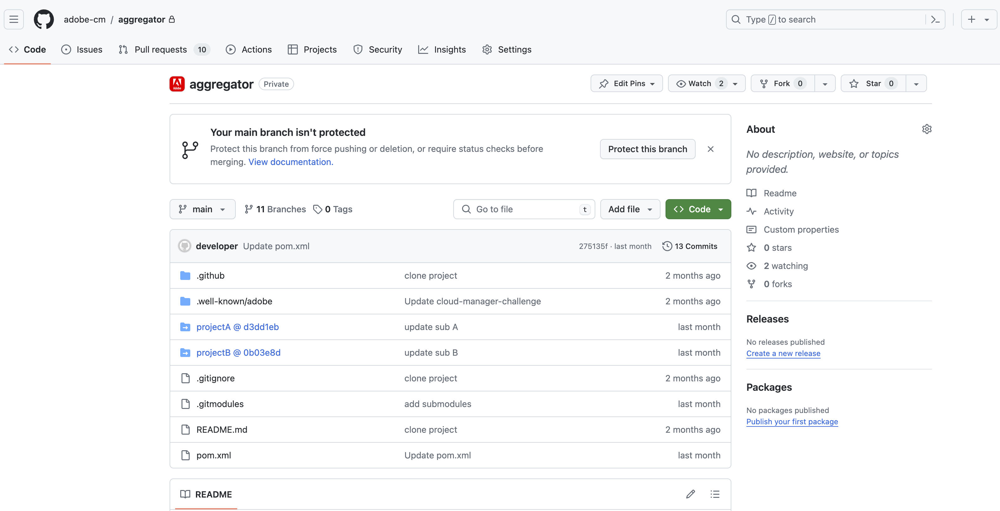

# Ondersteuning voor Git-submodule voor opslagplaatsen voor Adoben {#git-submodule-support}

Git-submodules kunnen worden gebruikt om de inhoud van meerdere vertakkingen tijdens het samenstellen samen te voegen tussen git-opslagruimten.

Wanneer het de bouwstijlproces van de Manager van de Wolk uitvoert, nadat de bewaarplaats die voor de pijpleiding wordt gevormd wordt gekloond en de gevormde tak wordt gecontroleerd, als de tak een bevat `.gitmodules` in de hoofdmap, wordt de opdracht uitgevoerd.

```
$ git submodule update --init
```

Dit zal elke submodule in de aangewezen folder uitchecken. Deze techniek is een mogelijk alternatief voor [werken met meerdere Git-opslagruimten](/help/managing-code/multiple-git-repos.md) voor organisaties die comfortabel zijn met het gebruik van git-submodules en geen extern samenvoegingsproces willen beheren.

Stel bijvoorbeeld dat er drie opslagruimten zijn die elk één vertakking met de naam `main`. In de &quot;primaire&quot; opslagplaats, d.w.z. de opslagplaats die in de pijpleidingen is geconfigureerd, `main` vertakking bevat een `pom.xml` dossier waarin de projecten in de andere twee gegevensbanken worden gedeclareerd:

```xml
<?xml version="1.0" encoding="UTF-8"?>
<project xmlns="http://maven.apache.org/POM/4.0.0" xmlns:xsi="http://www.w3.org/2001/XMLSchema-instance"
    xsi:schemaLocation="http://maven.apache.org/POM/4.0.0 http://maven.apache.org/maven-v4_0_0.xsd">
    <modelVersion>4.0.0</modelVersion>
   
    <groupId>customer.group.id</groupId>
    <artifactId>customer-reactor</artifactId>
    <version>0.0.1-SNAPSHOT</version>
    <packaging>pom</packaging>
   
    <modules>
        <module>project-a</module>
        <module>project-b</module>
    </modules>
   
</project>
```

Vervolgens voegt u submodules toe voor de andere twee opslagruimten:

```shell
$ git submodule add -b main https://git.cloudmanager.adobe.com/ProgramName/projectA/ project-a
$ git submodule add -b main https://git.cloudmanager.adobe.com/ProgramName/projectB/ project-b
```

Dit leidt tot een `.gitmodules` bestand dat er als volgt uitziet:

```text
[submodule "project-a"]
    path = project-a
    url = https://git.cloudmanager.adobe.com/ProgramName/projectA/
    branch = main
[submodule "project-b"]
    path = project-b
    url = https://git.cloudmanager.adobe.com/ProgramName/projectB/
    branch = main
```

Meer informatie over git-submodules vindt u in de [Handleiding Git](https://git-scm.com/book/en/v2/Git-Tools-Submodules).

## Beperkingen {#limitations}

Houd rekening met het volgende wanneer u it-submodules gebruikt:

* De URL van de it moet exact in de hierboven beschreven syntaxis staan.
* Sluit om beveiligingsredenen geen referenties in deze URL&#39;s in.
* Alleen submodules in de hoofdmap van de vertakking worden ondersteund.
* Git-submoduleverwijzingen worden opgeslagen naar specifieke it-opdrachten.
   * Dientengevolge, wanneer veranderingen in de submodule bewaarplaats worden aangebracht, moet het gecommitteerde referenced worden bijgewerkt, bijvoorbeeld door te gebruiken `git submodule update --remote`.
* Tenzij anders nodig, wordt het ten zeerste aanbevolen &quot;oppervlakkige&quot; submodules te gebruiken.
   * Voer hiervoor `git config -f .gitmodules submodule.<submodule path>.shallow true` voor elke submodule.


## Ondersteuning voor Git-submodule voor privéopslagplaatsen {#private-repositories}

Ondersteuning voor it-submodules bij gebruik [privéopslagplaatsen](private-repositories.md) is grotendeels hetzelfde als bij het gebruik van gegevensbanken voor Adoben.

Na het instellen van uw `pom.xml` en het bestand uitvoeren `git submodule` opdrachten, moet u een `.gitmodules` bestand naar de hoofdmap van de aggregatoropslagplaats voor Cloud Manager om de installatie van de submodule te detecteren.




### Beperkingen en Recommendations {#limitations-recommendations-private-repos}

Houd rekening met de volgende beperkingen wanneer u git-submodules gebruikt met persoonlijke opslagruimten.

* De URL&#39;s van de it voor de submodules kunnen de HTTPS- of SSH-indeling hebben, maar ze moeten een koppeling naar een github.com-opslagplaats maken
   * Het toevoegen van een ondermodule van de opslagplaats van de Adobe aan een aggregatorbewaarplaats GitHub of vice versa zal niet werken.
* De ondermodules GitHub moeten voor de AdobeApp toegankelijk zijn GitHub.
* [De beperkingen van het gebruik van git-submodules met door Adobe beheerde opslagplaatsen](#limitations-recommendations) ook van toepassing.