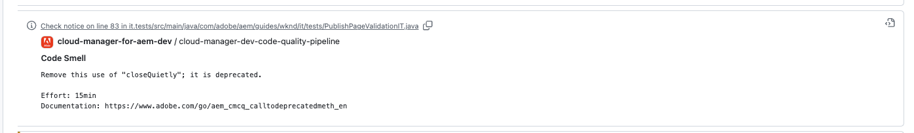

# GitHub-controleaantekeningen {#github-annotations}

Leer hoe de controles GitHub PRs voor uw privé bewaarplaatsen annoteert om u van nuttige te voorzien terugkoppelen.

## Overzicht {#overview}

Als u [ privé bewaarplaatsen ](private-repositories.md) voor uw programma van Cloud Manager gebruikt, worden de controles in GitHub automatisch in werking gesteld voor elk trekkingsverzoek. Deze controles zijn voorzien van nuttige informatie om u te helpen om het even welke kwesties met uw code zo snel mogelijk begrijpen.

{de kwaliteit van de 0} Code ](/help/using/code-quality-testing.md) kwesties die door [ worden ontdekt SonarQube ](/help/using/custom-code-quality-rules.md) zijn duidelijk vermeld.[

De exacte coderegel met de uitgave wordt opgegeven en u kunt erop klikken om de relevante code weer te geven. Deze annotaties worden gegeven voor alle code kwesties, niet alleen die kwesties die in het trekkingsverzoek worden veranderd.

Alle geannoteerde lijnen worden samengevoegd op het **Gewijzigde Dossiers** lusje op het trekkingsverzoek GitHub. Annotaties voor bestanden die niet zijn gewijzigd in de pull-aanvraag, worden in hun eigen sectie weergegeven.

## Pijpleidingen voor codeswaliteit {#code-quality-pipelines}

De [ resultaten van de Kwaliteit van de Code ](/help/using/code-quality-testing.md) zijn ook zichtbaar in de pijpleiding, die Cloud Manager automatisch bij de bodem van de **Controles** tabel teweegbrengt. Het is ook toegankelijk van de **Details** van de controle van het trekkingsverzoek.

U kunt de problemen ook visualiseren in de vorm van een CSV. Deze methode kan door [ worden teruggewonnen het bekijken van de details van de pijpleidingsuitvoering in Cloud Manager ](/help/using/managing-pipelines.md).
