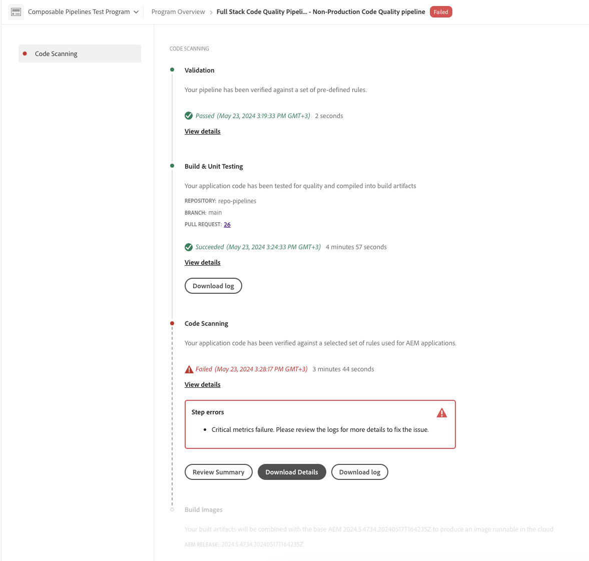

# Pijpleidingen beheren {#managing-pipelines}

Leer hoe u uw bestaande pijpleidingen beheert, inclusief het uitvoeren, bewerken en verwijderen ervan.

## Pipetkaart {#pipeline-card}

De **Pijpleidingen** kaart op de **pagina van het Overzicht van het Programma** in Cloud Manager geeft u een overzicht van al uw pijpleidingen en hun huidige status.

Door  naast elke pijpleiding te klikken, kunt u de volgende acties nemen:

* [ stel de pijpleiding ](#running-pipelines) in werking.
* [ geef de pijpleiding ](#editing-pipelines) uit.
* [ Schrap de pijpleiding ](#deleting-pipelines).
* [ details van de Mening ](#view-details).

Onder aan de lijst met pijpleidingen staan de volgende algemene opties.

* **voeg** toe - aan [ voeg een nieuwe productiepijpleiding ](/help/using/production-pipelines.md) toe of [ voeg een nieuwe niet-productiepijpleiding ](/help/using/non-production-pipelines.md) toe.
* **toon allen** - neemt de gebruiker aan het **scherm van Pijpleidingen** om alle pijpleidingen in een meer gedetailleerde lijst te bekijken.
* **Info van de Reactie van de Toegang** - toont de informatie noodzakelijk om tot de bewaarplaats van de Git van Cloud Manager toegang te hebben.
* **leer Meer** - navigeert aan CI/CD de middelen van de pijpleidingsdocumentatie.

## Pagina met pijplijnen {#pipelines}

De **pagina van Pijpleidingen** toont een volledige lijst van alle pijpleidingen voor het geselecteerde programma. Deze lijst is nuttig omdat het uitvoerigere informatie dan voorstelt wat in de [ kaart van Pijpleidingen ](#pipeline-card) beschikbaar is.

1. Logboek in Cloud Manager bij [ my.cloudmanager.adobe.com ](https://my.cloudmanager.adobe.com/) en selecteert de aangewezen organisatie en het programma.

1. Van de **pagina van het Overzicht van het Programma**, klik het **Pijpleidingen** lusje om aan de **Pijpleidingen** pagina over te schakelen.

1. Hier kunt u een lijst van alle pijpleidingen voor het programma zien en pijpleidingsuitvoering beginnen en tegenhouden zoals u in de **Kaart van Pijpleidingen**.

Als u op het pictogram `i` klikt, worden de details van de laatste of huidige uitvoering van de pijplijn weergegeven.

Het klikken **details van de Mening** neemt u aan de [ details van de pijpleidingsuitvoering ](#view-details).

## Activiteitenpagina {#activity}

De **pagina van Activiteiten** toont een volledige lijst van alle pijplijnuitvoeringen voor het geselecteerde programma.

1. Logboek in Cloud Manager bij [ my.cloudmanager.adobe.com ](https://my.cloudmanager.adobe.com/) en selecteert de aangewezen organisatie en het programma.

1. Van de **pagina van het Overzicht van het Programma**, klik het **lusje van de Activiteit** om aan de **pagina van de Activiteit** over te schakelen.

1. Hier ziet u een lijst van alle pijpleiding uitvoeringen voor het programma met inbegrip van huidige en historische executies.

Als u op het pictogram `i` klikt, worden meer details over de uitvoering van de geselecteerde pijpleiding weergegeven.

Klik **details van de Mening** om [ details van de pijpleidingsuitvoering ](#view-details) te herzien.

## Een pijplijn uitvoeren {#run-one-pipeline}

1. Logboek in Cloud Manager bij [ my.cloudmanager.adobe.com ](https://my.cloudmanager.adobe.com/) en selecteert de aangewezen organisatie en het programma.
1. Navigeer aan de **Pipelines** kaart van de **pagina van het Overzicht van het Programma**.
1. Klik  naast de pijpleiding die u in werking stelt, dan klik **Looppas**.

   De kolom van de Status wijst erop wanneer de pijpleidingslooppas begint.

   U kunt de details van de looppas zien door  opnieuw te klikken en **[details van de Mening](#view-details)** te klikken.

   Afhankelijk van het type van pijpleiding, kunt u de looppas kunnen annuleren door  opnieuw te klikken en **te klikken annuleert**.

## Meerdere pijpleidingen uitvoeren {#run-multiple-pipelines}

Met Cloud Manager kunt u meerdere pijpleidingen tegelijk uitvoeren, waardoor de efficiëntie van de implementatie voor klanten van Adobe Managed Services (AMS) wordt verbeterd. De **Looppas geselecteerde** eigenschap laat u veelvoudige pijpleidingen selecteren en hen teweegbrengen om meteen te lopen. Het vermindert de handmatige inspanning van het moeten pijpleidingen individueel in werking stellen en optimaliseert bouw en plaatsingswerkschema&#39;s.

**om veelvoudige pijpleidingen in werking te stellen:**

1. Logboek in Cloud Manager bij [ my.cloudmanager.adobe.com ](https://my.cloudmanager.adobe.com/) en selecteert de aangewezen organisatie en het programma.
1. Van het linkerzijmenu, klik  **Pijpleidingen**.
1. In de lijst op de **pagina van de Pijpleiding**, selecteer checkboxes naast de pijpleidingen u wilt lopen.
Indien noodzakelijk, klik  **Filters** aan soortpijpleidingen door milieu, of opgesteld codetype, of allebei.
1. Dichtbij de hoger-juiste hoek van de pagina, klik **Geselecteerde Looppas (x)**.
1. In de **Looppas geselecteerde pijpleidingen (x)** dialoogdoos, klik **Looppas (x)**.

   De **looppas** knoop wijst op het aantal pijpleidingen die kunnen te werk gaan. U hebt bijvoorbeeld vier pijpleidingen geselecteerd, maar er is al een pijpleiding actief. Of een omgeving die is gekoppeld aan een geselecteerde pijpleiding bestaat niet meer. In dergelijke gevallen wordt het systeem dienovereenkomstig aangepast. De knop wordt bijgewerkt naar &quot;Uitvoeren (3)&quot; om aan te geven dat drie pijpleidingen kunnen doorgaan.

1. De pijpleidingen beginnen lopend, en hun status wordt bijgewerkt in de **lijst van Pijpleidingen**.

## Pijpleidingen bewerken {#editing-pipelines}

U kunt geen pijpleiding uitgeven die loopt.

**om pijpleidingen uit te geven:**

1. Logboek in Cloud Manager bij [ my.cloudmanager.adobe.com ](https://my.cloudmanager.adobe.com/) en selecteert de aangewezen organisatie en het programma.

1. Van de **pagina van het Overzicht van het Programma**, navigeer aan de **Pijpleidingen** kaart.

1. Klik  naast de pijpleiding die u wilt uitgeven, dan klikken **geeft** uit.

1. In **geeft de Pijpleiding van de Productie uit** of **geeft niet-Productie pijplijn** dialoogdoos uit, kunt u de zelfde details uitgeven die u tijdens pijpleidingsverwezenlijking inging.

   Zie [ het Vormen de Pijpleidingen van de Productie ](/help/using/production-pipelines.md) en [ het Vormen niet-Productiepijpleidingen ](/help/using/non-production-pipelines.md) voor details op de gebieden en configuratieopties beschikbaar voor pijpleidingen.

1. Wanneer u wordt gedaan, klik **Update**.

## Pijpleidingen verwijderen {#deleting-pipelines}

U kunt geen lopende pijpleiding schrappen.

**om pijpleidingen te schrappen:**

1. Logboek in Cloud Manager bij [ my.cloudmanager.adobe.com ](https://my.cloudmanager.adobe.com/) en selecteert de aangewezen organisatie en het programma.

1. Van de **pagina van het Overzicht van het Programma**, navigeer aan de **Pijpleidingen** kaart.

1. Klik  naast de pijpleiding die u in werking stelt, dan **Schrapping** klikken.

## Details van pijpleiding weergeven {#view-details}

U kunt details van een pijpleiding slechts bekijken die loopt of minstens eens in werking is gesteld.

**om pijpleidingsdetails te bekijken:**

1. Logboek in Cloud Manager bij [ my.cloudmanager.adobe.com ](https://my.cloudmanager.adobe.com/) en selecteert de aangewezen organisatie en het programma.

1. Van de **pagina van het Overzicht van het Programma**, navigeer aan de **Pijpleidingen** kaart.

1. Klik  naast de pijpleiding die u in werking stelt, dan klik **Details van de Mening**.

1. U wordt genomen aan de detailspagina van de lopende pijpleiding.

Van hier, kunt u het statuut van de diverse stappen van de pijpleiding zien en bouwstijllogboeken voor kenmerkende doeleinden terugwinnen. Zie de plaatsing van de code van het document  voor meer informatie.

Alle stappen in een pijpleidingsuitvoering worden getoond met degenen die nog niet uit grijs begonnen. De voltooide stappen tonen hun duur.

Wanneer een pijpleidingsstap volledig is, wordt een samenvatting voorgesteld.

Klik de **verbinding van de Details van de Mening** om de **sectie van de Duur** te openbaren. In dit deel wordt de gemiddelde duur van de pijpleiding vermeld op basis van de historische trend voor dat programma.

Als uw pijpleiding a **Code Scanning** stap bevatte, die kwesties opriep, kunt u **Details van de Download** klikken om een lijst van [ tests van de codekwaliteit ](/help/using/code-quality-testing.md) te bekijken die niet overgegaan.

De kolom van de Plaats van het Dossier van het A **Project** is beschikbaar in het Csv- dossier om op de plaats van de beledigende code te wijzen. Deze kolom is de project-relatieve weg, terwijl de **kolom van de Plaats van het 0} Dossier {wordt geproduceerd.**

